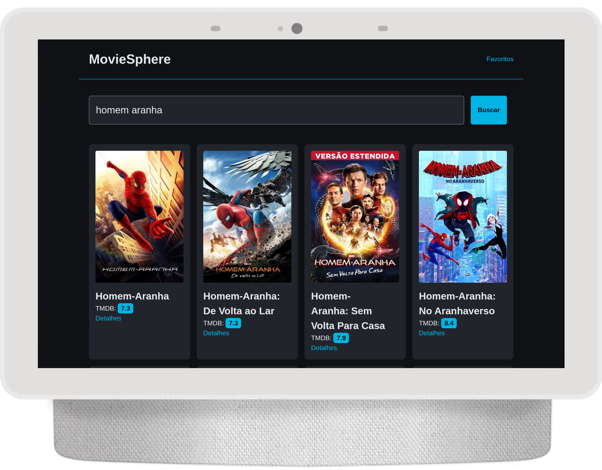
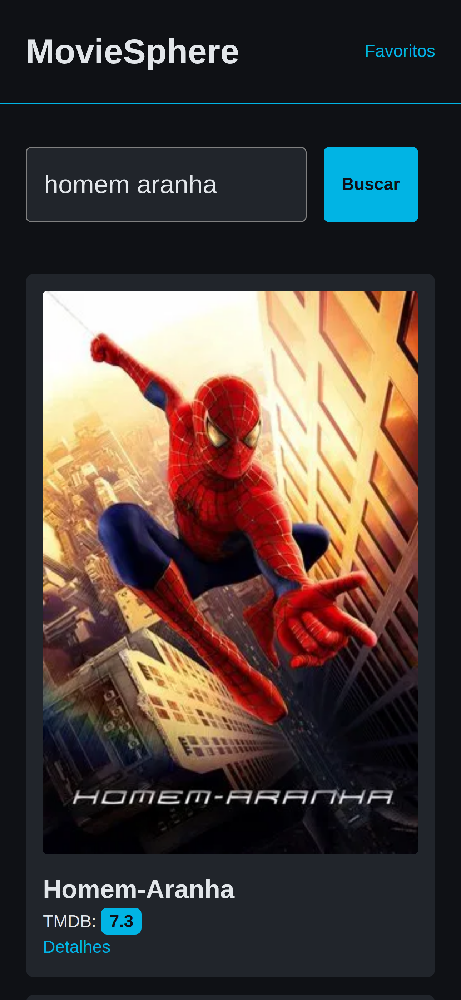
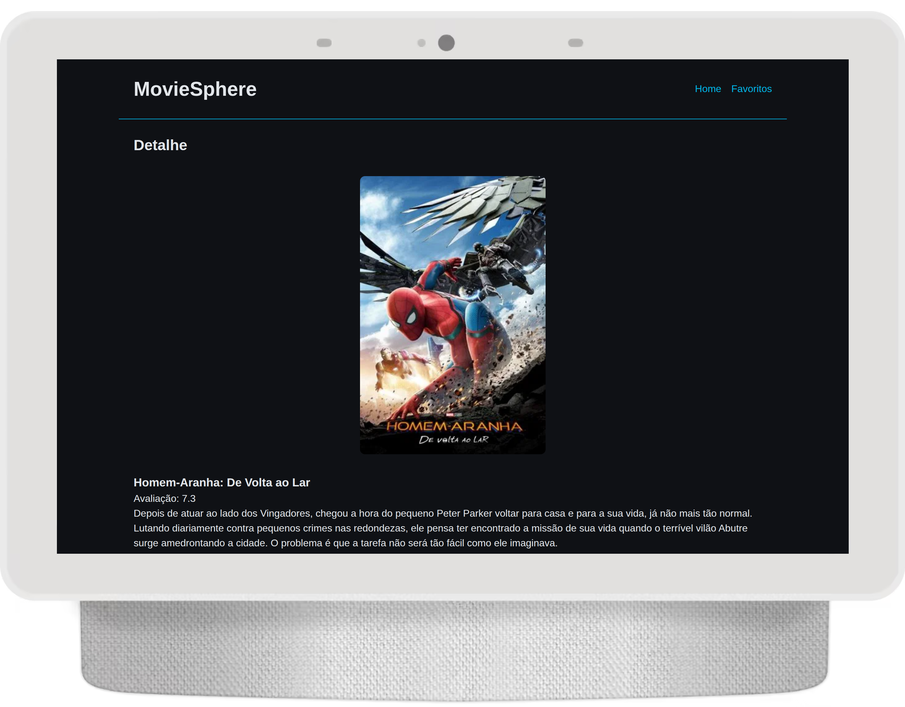
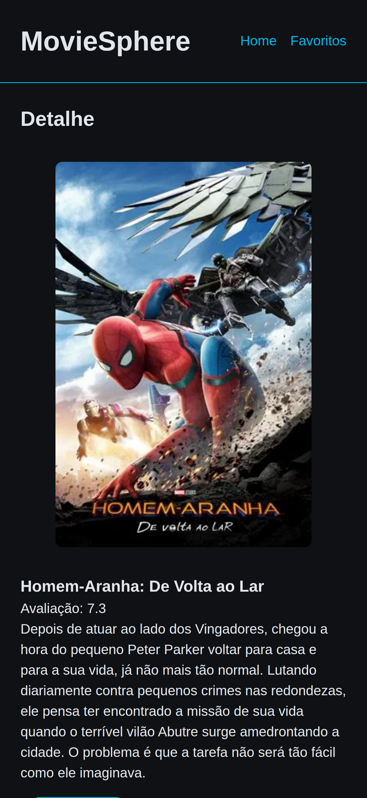
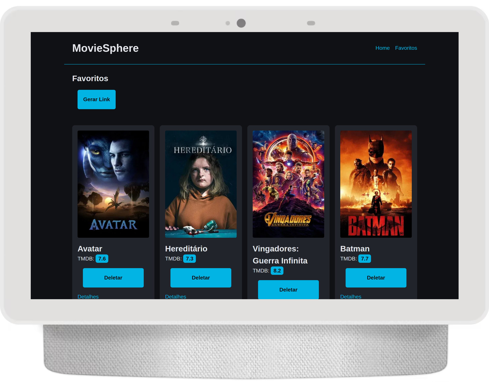
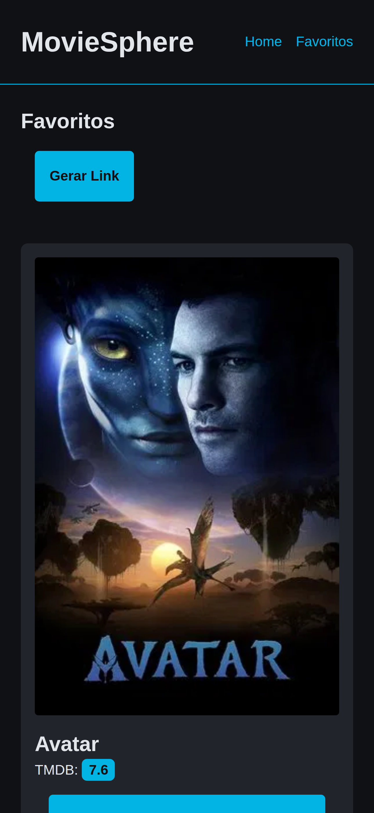

# 🎬 MovieSphere

Aplicação full stack que permite buscar filmes via **TMDb API**, favoritar títulos, visualizar detalhes, gerar links de compartilhamento e acessar listas públicas.  
Frontend em **React + Vite**, backend em **Node.js + Express + Prisma**, banco **PostgreSQL**, e deploys no **Vercel** e **Render**.

---

## Telas

| Desktop               | Mobile                                |
| --------------------- | ------------------------------------- |
| |   |
| |   |
| |   |

## 🌐 Deploy

| Serviço               | URL                                   |
| --------------------- | ------------------------------------- |
| **Frontend (Vercel)** | https://movie-sphere-iota.vercel.app  |
| **Backend (Render)**  | https://moviesphere-hge1.onrender.com |

---

## 🧱 Arquitetura

/moviesphere  
├── movie-list-backend → API Node.js (Express + Prisma)  
└── movie-list-frontend → UI React (Vite)

### Fluxo

1. Frontend consome o backend hospedado no Render.
2. O backend faz proxy seguro para a **TMDb API** (não expondo a chave).
3. Favoritos são armazenados no banco (PostgreSQL) hospedado no render.
4. O backend gera tokens de compartilhamento com links públicos.

---

## 🧩 Tecnologias Principais

### Frontend

-   React + Vite (TypeScript)
-   React Router DOM
-   Axios
-   Styled-Components
-   Deploy → [Vercel](https://movie-sphere-iota.vercel.app/)

### Backend

-   Node.js + Express
-   Prisma ORM
-   PostgreSQL no render
-   Axios (consumo TMDb)
-   Zod (validação)
-   CORS
-   nanoid
-   dotenv
-   nodemon
-   Deploy → [Render](https://moviesphere-hge1.onrender.com)

### Testes

-   Postman

---

## 🚀 Como Rodar Localmente

1. Clonar o repositório

```bash
git clone https://github.com/Jonas-petty/MovieSphere.git
cd moviesphere
```

2. Backend

```bash
cd moviesphere-backend
npm install

```

Adicione o .env

```env
PORT=3000
TMDB_API_KEY=sua_chave_da_tmdb
DATABASE_URL=link_para_db_postgres
FRONTEND_ORIGIN=url_local_do_frontend
```

Roda o backend

```bash
npx prisma migrate dev
npm run

Backend em: http://localhost:3000
```

3. Frontend  
   Em outro terminal:

```bash
cd movie-list-frontend
npm install
```

Adicione o .env

```env
VITE_API_BASE_URL=http://localhost:3000
```

Roda o Frontend

```bash
npm run dev

Frontend em: http://localhost:5173
```

## 🧭 Rotas

| Método     | Rota                          | Descrição                        |
| ---------- | ----------------------------- | -------------------------------- |
| **GET**    | `/movies/search?query=batman` | Busca filmes na TMDb             |
| **GET**    | `/movies/:id`                 | Detalhes do filme                |
| **GET**    | `/favorites`                  | Lista favoritos                  |
| **POST**   | `/favorites`                  | Adiciona favorito                |
| **DELETE** | `/favorites/:movie_id`        | Remove favorito                  |
| **POST**   | `/share`                      | Gera token de compartilhamento   |
| **GET**    | `/share/:token`               | Retorna lista pública pelo token |

Desenvolvido com 💙 por Jons Felix de Souza
